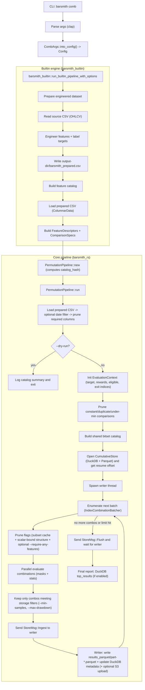

# Barsmith

High-performance feature combination search over engineered OHLCV bars.

WARNING: This repository is currently unstable. Use at your own risk.

Barsmith is designed for long-running, resume-friendly exploration runs:
- Load a CSV dataset, engineer features, and search combinations up to a configurable depth.
- Persist results incrementally (Parquet + DuckDB) so you can stop/restart without losing progress.
- Keep memory usage predictable via shared columnar data and reuse of intermediate masks.

This repository is self-contained and does not depend on any external Python code.

## Status

Unstable. APIs, CLI flags, and output schemas may change without notice.

## Key features

- **Combination search (`comb`)**: AND/OR feature logic, depth limits, min-sample gating, optional feature-pairs, resume offsets.
- **Resume & durability**: incremental Parquet parts + a DuckDB view for fast `top results` queries.
- **Deterministic runs**: stable CSV fingerprinting and config hashing to prevent accidental “resume on the wrong dataset”.
- **Research-friendly runs**: deterministic dataset fingerprinting + resume metadata to protect long experiments.
- **Optional S3 upload**: upload outputs using `aws s3 cp` (requires AWS CLI on PATH).

## Quickstart

Requires Rust (stable).

Run a small dry-run on the included sample dataset:

```bash
cargo run -p barsmith_cli -- comb \
  --csv tests/data/ohlcv_tiny.csv \
  --direction long \
  --target next_bar_color_and_wicks \
  --output-dir ./tmp/run_01 \
  --max-depth 3 \
  --min-samples 100 \
  --workers 1 \
  --max-combos 1000 \
  --dry-run
```

Run a real (small) exploration run:

```bash
cargo run -p barsmith_cli -- comb \
  --csv tests/data/ohlcv_tiny.csv \
  --direction long \
  --target next_bar_color_and_wicks \
  --output-dir ./tmp/run_01 \
  --max-depth 3 \
  --min-samples 100 \
  --workers 1 \
  --max-combos 10000
```

### Install (local)

Install the CLI binary from source:

```bash
cargo install --path barsmith_cli
```

Then run it as:

```bash
barsmith_cli --help
barsmith_cli comb --help
```

## Outputs (what gets written)

`--output-dir` becomes a durable “run folder”. You’ll typically see:

- `barsmith_prepared.csv` (engineered dataset produced for the run)
- `results_parquet/part-*.parquet` (incremental result batches)
- `cumulative.duckdb` (DuckDB catalog and views over all batches)
- `barsmith.log` (unless `--no-file-log` is set)

Barsmith can resume from an existing output directory as long as the CSV fingerprint matches (unless `--force` is used). When reusing an existing `--output-dir`, pass `--ack-new-df` so the CLI can overwrite `barsmith_prepared.csv`.

## How `comb` works



### Prepared dataset requirements (what the pipeline expects)

The core pipeline (`barsmith_rs`) expects a “prepared” dataset that contains:

- `target` as a boolean column (name is whatever you pass via `--target`)
- `rr_<target>` (optional) as a float reward per row (R units)
- `<target>_eligible` (optional) as a boolean gate for trade eligibility
- `<target>_exit_i` (required when `--stacking-mode no-stacking`) as an integer next index to jump to after a trade

The default CLI generates this prepared dataset via `barsmith_builtin` and writes it to `output-dir/barsmith_prepared.csv`.

Note: the built-in CLI always writes `barsmith_prepared.csv`. If that file already exists in `--output-dir`, you must pass `--ack-new-df` to overwrite it.

## Data format

Input must be a CSV with (at minimum) these columns:

- `timestamp` (ISO-8601; UTC recommended)
- `open`, `high`, `low`, `close` (numeric)
- `volume` (numeric)

The default CLI uses `barsmith_builtin` for feature engineering + target labeling, and currently supports:

- `--target next_bar_up` (boolean)
- `--target next_bar_down` (boolean)
- `--target next_bar_color_and_wicks` (compatibility alias for `next_bar_up`)

For richer feature sets/targets, use `barsmith_rs` as a library and provide your own “prepared dataset” (see the requirements above), or treat `custom_rs` as an example engine.

## Docs

- `docs/README.md` (index)
- `docs/quickstart.md`
- `docs/data-contract.md`
- `docs/cli.md`
- `docs/runs.md`
- `docs/outputs.md`
- `docs/architecture.md`
- `docs/engines.md`
- `docs/performance.md`
- `docs/troubleshooting.md`
- `docs/development.md`

## CLI reference

List commands:

```bash
cargo run -p barsmith_cli -- --help
```

Search combinations:

```bash
cargo run -p barsmith_cli -- comb --help
```

### S3 upload

`--s3-output s3://bucket/prefix` enables upload targets and `--s3-upload-each-batch` uploads after every ingestion batch.

This uses the AWS CLI (`aws s3 cp`) and does not embed AWS credentials logic in Barsmith.

## Performance

Internal benchmark (not a guarantee): on a MacBook Pro (Apple M4), Barsmith explored ~120B combination candidates over ~5 days.

Performance depends heavily on:
- feature catalog size and depth
- `--stats-detail` (`core` vs `full`)
- logical mode (AND/OR)
- storage filters (`--min-samples`, `--max-drawdown`, reporting thresholds)
- CPU and memory bandwidth

## Sample long-run command (macOS)

This is an example command from a real long run. It is macOS-specific (`caffeinate`) and this repo is marked unstable.

Note: the default built-in engine currently only supports `next_bar_up`, `next_bar_down`, and the alias `next_bar_color_and_wicks`. Targets like `2x_atr_tp_atr_stop` require a different engine / prepared dataset contract.

```bash
caffeinate -dimsu cargo run --release -p barsmith_cli -- comb --csv ../es_30m.csv --direction short --target 2x_atr_tp_atr_stop --output-dir ../tmp/barsmith/2x_atr_tp_atr_stop/es_30m_official_v2_short_no_stacking --max-depth 5 --min-samples 4000 --logic and --date-end 2024-12-31 --feature-pairs --auto-batch --batch-size 8000000 --report formula --top-k 10000 --max-drawdown 25 --max-drawdown-report 25 --min-calmar-report 1.0 --subset-pruning --asset mes --profile-eval off
```

## Project layout

- `barsmith_rs/`: core library (data loading, combination enumeration, evaluation, storage).
- `barsmith_builtin/`: minimal built-in feature engineering + targets (used by the default CLI).
- `barsmith_cli/`: CLI (`comb`).
- `custom_rs/`: richer example feature engineering + targets (not required for the default CLI; treated as an example/experimental engine).
- `tests/`: repository-level fixtures used by smoke tests.

## Open-source hygiene

This repo is private-first today, but it includes the usual open-source hygiene files:

- `LICENSE` (MIT)
- `SECURITY.md`
- `CONTRIBUTING.md`
- `CODE_OF_CONDUCT.md`
- crate metadata (`license`, `repository`, `rust-version`, etc.) in `Cargo.toml`
- `CHANGELOG.md`
- `rust-toolchain.toml` (pinned toolchain for consistent `rustfmt`/`clippy`)

## License

MIT — see `LICENSE`.

## Disclaimer

Barsmith is a research tool. It does not connect to brokers, place orders, or provide financial advice.
